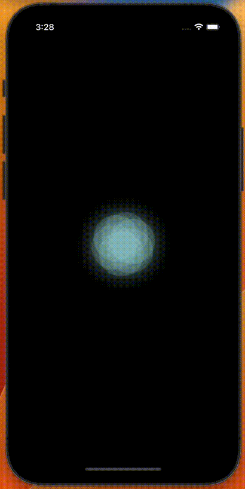

  A breathing animation with React Native and Skia library.

<h1 align="center">Breathing Animation</h1>
 

</img>
</img>

Inspired by the [Skia Docs](https://shopify.github.io/react-native-skia/docs/getting-started/installation). 🎨

You can use this animation in your project. Please check the `src/Breath.tsx` component.

## Quick start

1. Clone the repo.
2. Change directory to the project.
3. Run `yarn start` to start the Metro Bundler.
4. Press `i` to start the iOS simulator, `a` to run the Android emulator or `w` for Web.📱

## Available commands

- `yarn start` - start Metro Bundler.
- `yarn ios` - run on iOS.
- `yarn android` - run on Android.
- `yarn web` - run on web.
- `yarn lint` - check code for errors.
- `yarn release` - generate a changelog, bump the version of app and create a new tag.
